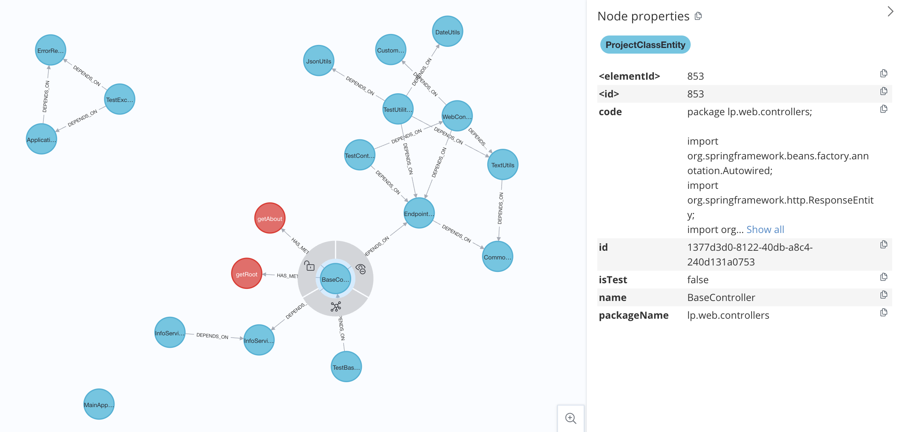

# Project DB Importer

**Project DB Importer** is a tool that scans a Java project,
maps the classes and their relationships
and imports them into a graph database using Neo4j. 

It can be easily integrated into Spring Boot projects.

## Features

- Automatic scanning of Java classes within a project.
- Mapping of relationships between classes (inheritance, dependencies, etc.).
- Import of classes and relationships into Neo4j for graph visualization and analysis.

## Technologies Used

- **Java 21**: Main language of the project.
- **Spring Boot**: Framework used for managing the application and configurations.
- **Neo4j**: Graph database used to store and visualize classes and relationships.

## Installation and Configuration

1. Clone this repository:

   ```bash
   git clone https://github.com/your-username/project-db-importer.git
   cd project-db-importer

2. Configure Neo4j credentials in the application.properties file 
of the project where you will integrate Project DB Importer:

```spring
spring.neo4j.uri=bolt://localhost:7687
spring.neo4j.authentication.username=neo4j
spring.neo4j.authentication.password=password
```

Add Project DB Importer as a dependency to your Spring Boot project (either by including the project or adding the dependency to your pom.xml or build.gradle).

With Maven:

```xml
<dependency>
<groupId>lp.web</groupId>
<artifactId>project-db-importer</artifactId>
<version>1.0.0</version>
</dependency>
```

With Gradle:

```gradle
implementation 'lp.web:project-db-importer:1.0.0'
```

Autowired the ProjectService in your code to use the scanning and import features:

```java
@Autowired
private ProjectService projectService;
```

## Usage
After integration and configuration, you can invoke the scan method within your project. 

For example:

```java
projectService.importProjectInDB("PROJECT_FOLDER");
```

The class and relationship data will be imported into the Neo4j database.

You can run Cypher queries in Neo4j to visualize and analyze the relationships between classes. For example:

```cypher
MATCH (c:ProjectClassEntity) RETURN c
```

### Example Output

After scanning a Java project, the resulting graph in Neo4j will show classes as nodes and relationships between them (such as inheritance and dependencies) as edges.

